# Frontend Mentor - E-commerce product page solution


[](https://www.frontendmentor.io/)
[](https://vitejs.dev)


[](./assets/downloads/lighthouse-performance-report.pdf)

This is a solution to the [E-commerce product page challenge on Frontend Mentor](https://www.frontendmentor.io/challenges/ecommerce-product-page-UPsZ9MJp6). Frontend Mentor challenges help you improve your coding skills by building realistic projects.

## Table of contents

- [Overview](#overview)
  - [The challenge](#the-challenge)
  - [Screenshot](#screenshot)
  - [Links](#links)
- [My process](#️my-process)
  - [Built with](#built-with)
  - [Project Architecture](#project-architecture)
  - [Accessibility Features](#accessibility-features)
  - [What I learned](#what-i-learned)
  - [Continued development](#continued-development)
  - [Useful resources](#useful-resources)
  - [AI Collaboration](#ai-collaboration)
- [Author](#author)
- [Acknowledgments](#acknowledgments)

---

## 📖Overview

### The challenge

Users should be able to:

- View the optimal layout for the site depending on their device's screen size
- See hover states for all interactive elements on the page
- Open a lightbox gallery by clicking on the large product image
- Switch the large product image by clicking on the small thumbnail images
- Add items to the cart
- View the cart and remove items from it

---

### 📸Screenshot

#### Mobile (375x914)

| _Main_ | _Menu_ |
| ------ | ------ |
| 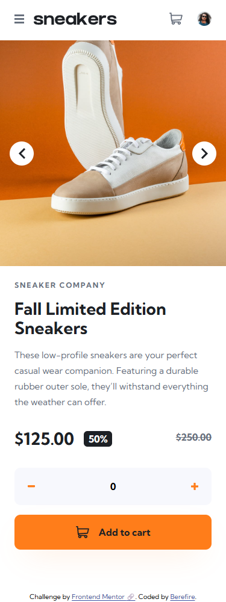 | 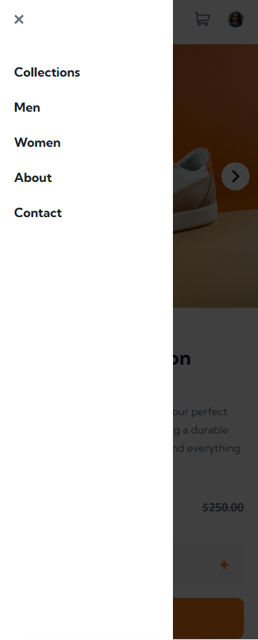 |

| _Active - Basket Empty_ | _Active - Basket Filled_ |
| ----------------------- | ------------------------ |
| 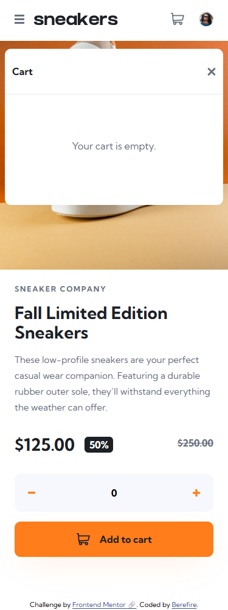 | 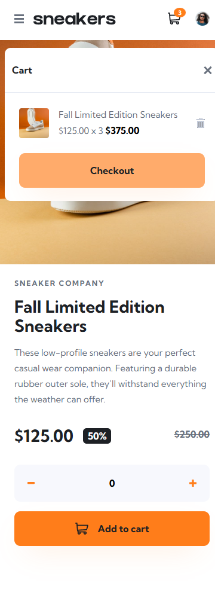 |

#### Tablet (768x914)

| _Main_ | _Menu_ |
| ------ | ------ |
| 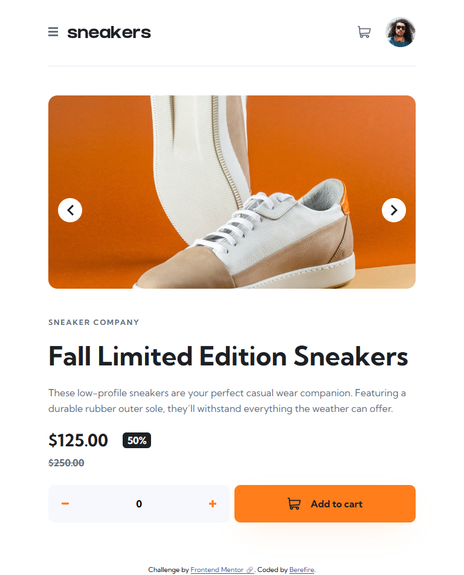 | 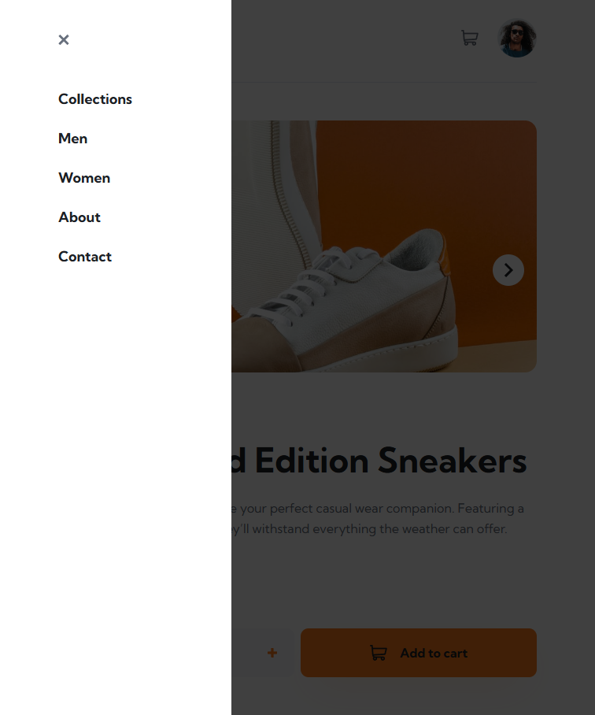 |

| _Active - Basket Empty_ | _Active - Basket Filled_ |
| ----------------------- | ------------------------ |
| 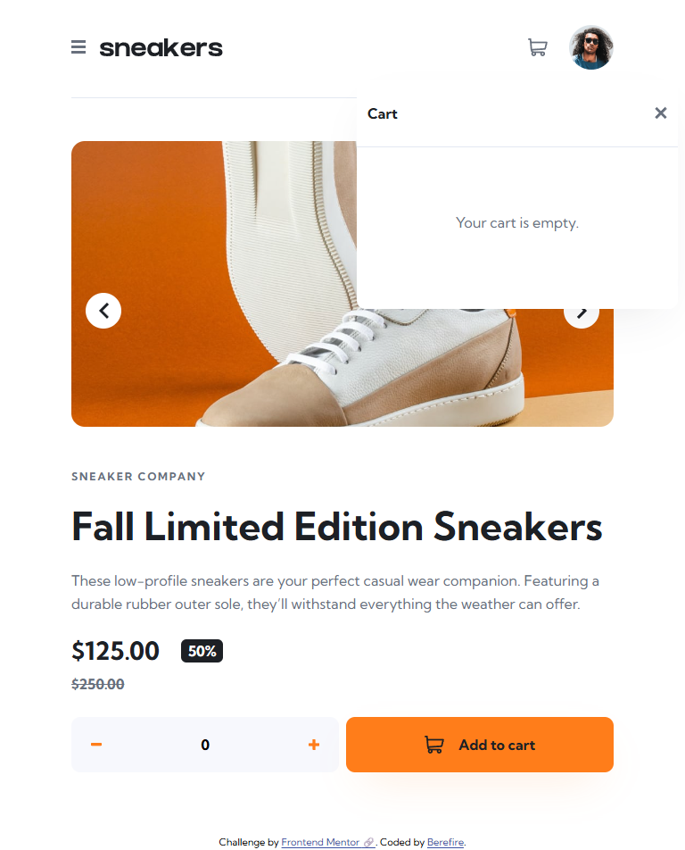 | 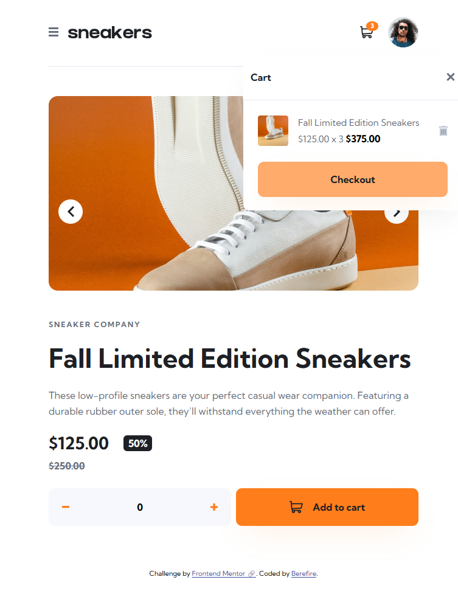 |

#### Desktop (1440x914)

| _Main_ | _Lightbox_ |
| ------ | ------ |
| 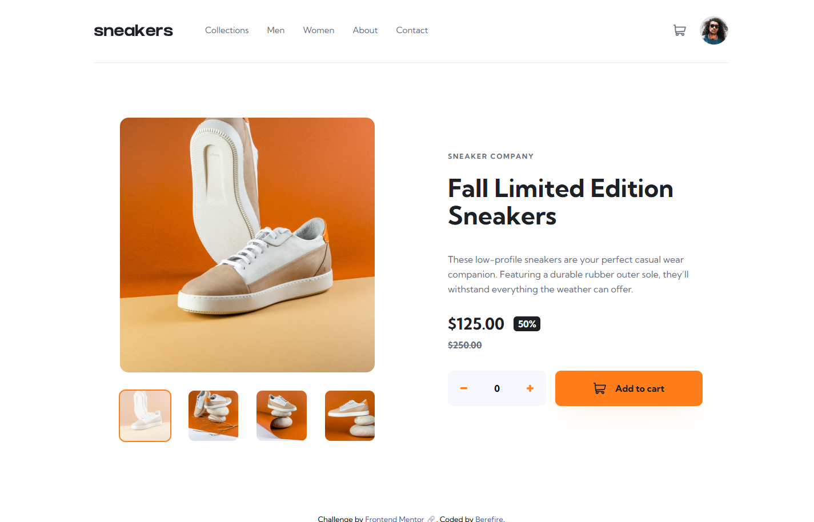 | 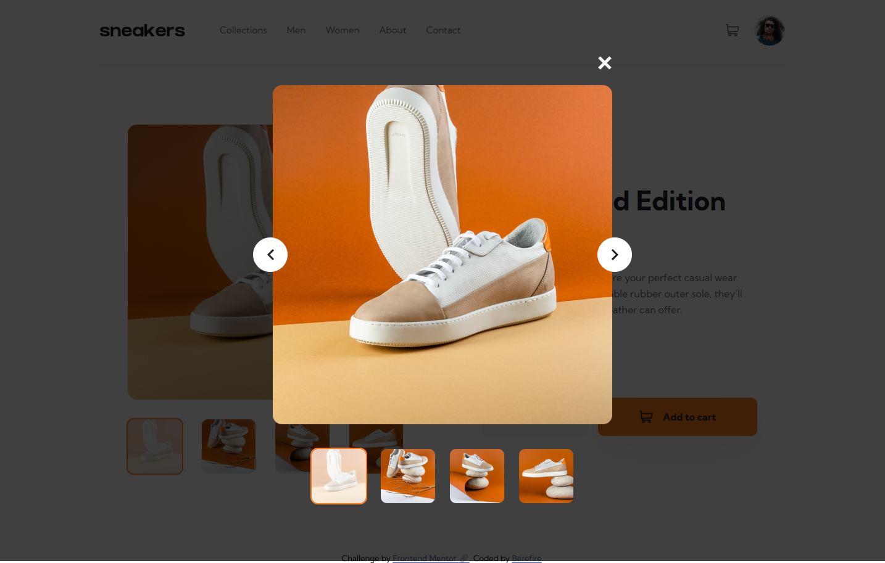 |

| _Active - Basket Empty_ | _Active - Basket Filled_ |
| ----------------------- | ------------------------ |
| 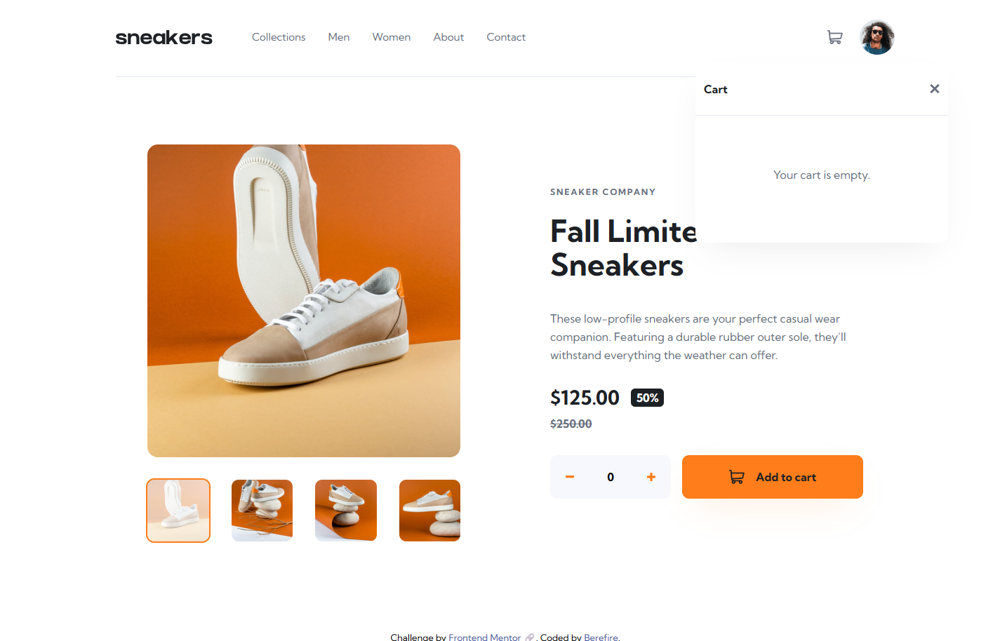 | 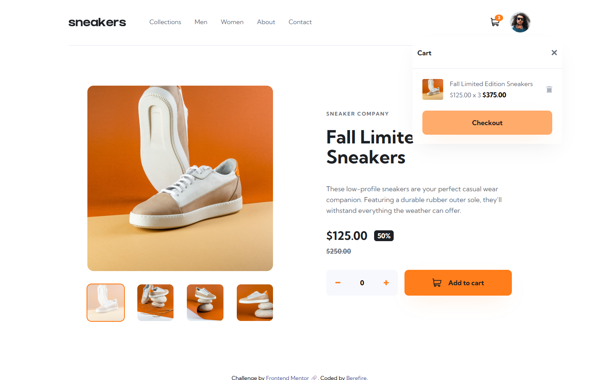 |

---

### 🔗Links

- Solution URL: [https://www.frontendmentor.io/solutions/e-commerce-product-page-with-accessible-ui-and-lightbox-na_ULNsXzc](https://www.frontendmentor.io/solutions/e-commerce-product-page-with-accessible-ui-and-lightbox-na_ULNsXzc)
- Live Site URL: [https://berefire.github.io/ecommerce-product-page/#](https://berefire.github.io/ecommerce-product-page/#)

## ⚙️My process

### 🛠Built with

- Semantic HTML5 markup
- Modern CSS
- CSS custom properties
- Cube CSS Architecture
- Flexbox
- CSS Grid
- Mobile-first workflow
- Vainilla JavaScript (ES Modules)
- Vite
- GitHub Pages

---

### 🔎Project Architecture

This project follows a modular JavaScript architecture where each feature is isolated into its own module.

```html
src/ 
├── assets/ 
├── js/ 
│ ├── features/ 
│ │ ├── add-to-cart/ 
│ │ ├── cart/ 
│ │ ├── gallery/ 
│ │ ├── lightbox/
│ │ ├── lightbox-gallery/ 
│ │ ├── menu/ 
│ │ └── quantity-box/ 
│ └── shared/ 
│ ├── dom.js 
│ ├── images.js 
│ ├── media.js 
│ ├── constants.js 
│ └── scroll.js 
└── styles/ 
  ├──  tokens/ 
  ├──  base/ 
  ├──  layout/ 
  ├──  components/ 
  ├──  states/ 
  └──  utilities/
```

Each feature is responsible for its own:

- Controller
- Event bindings
- Initialization logic

This approach keeps components independent, maintainable, and easier to test.

---

### ♿Accessibility features

Accessibility was a major focus throughout the project.

Implemented features include:

- Semantic HTML structure.
- Accessible dialog elements using `<dialog>`.
- Proper heading hierarchy.
- Keyboard navigation support.
- Focus-visible styles for interactive controls.
- Accessible icon buttons with descriptive labels.
- Decorative SVGs hidden from assistive technologies.
- Lightbox dialog with focus management.
- Cart dialog with keyboard support and Escape key handling.
- Mobile navigation dialog with focus trapping.
- Screen-reader-only content where appropriate.

---

### 💡What I learned

This project helped me gain a deeper understanding of:

- Building reusable UI components with Vanilla JavaScript.
- Managing application state without a framework.
- Structuring larger projects using a feature-based architecture.
- Using the native `<dialog>` element effectively.
- Implementing accessible image galleries and dialogs.
- Applying CUBE CSS principles to real-world interfaces.
- Creating responsive layouts using CSS Grid and Flexbox.

One implementation I'm particularly happy with is the modular gallery controller:

```js
export function showNextImage() { 
  currentIndex = (currentIndex + 1) % PRODUCT_IMAGES.length; 
  render(); 
}
```

This keeps navigation logic simple while supporting both the main gallery and lightbox gallery.

---

### 🚀Continued development

Future areas of focus include:

- More advanced state management patterns.
- Automated accessibility testing.
- Improved component composition patterns.
- Advanced animation techniques.
- Enhanced testing workflows using Vitest.
- Exploring Web Components for reusable UI patterns.

---

### 📚Useful resources

- [https://frontendmentor.io](https://frontendmentor.io) - Great platform for practicing realistic frontend projects.
- [https://cube.fyi](https://cube.fyi) - Excellent resource for learning and applying CUBE CSS.
- [https://developer.mozilla.org](https://developer.mozilla.org) - My primary reference for HTML, CSS, JavaScript, and accessibility.
- [https://www.w3.org/WAI/](https://www.w3.org/WAI/) - Helpful accessibility guidance and best practices.

---

### 🤖AI Collaboration

AI tools were used throughout development as a learning and productivity aid.

#### Tools Used

- ChatGPT

#### How AI Was Used

- Debugging JavaScript issues.
- Reviewing accessibility decisions.
- Discussing component architecture.
- Refining CSS layouts.
- Exploring dialog and focus-management patterns.
- Reviewing semantic HTML structure.

#### What Worked Well

- Architecture discussions.
- Accessibility reviews.
- Code review feedback.
- Exploring alternative implementations.

#### What Didn't Work Well

- AI-generated code still required manual review and testing.
- Accessibility recommendations needed verification against real user interactions and browser behavior.

AI was used as a collaborative learning tool rather than a replacement for implementation, testing, or decision-making.

---

## 👤Author

- Frontend Mentor - [@berefire](https://www.frontendmentor.io/profile/berefire)
- GitHub - [@berefire](https://github.com/berefire)

---

## 🙏Acknowledgments

Thanks to Frontend Mentor for providing practical challenges that help developers improve real-world frontend skills.

---
